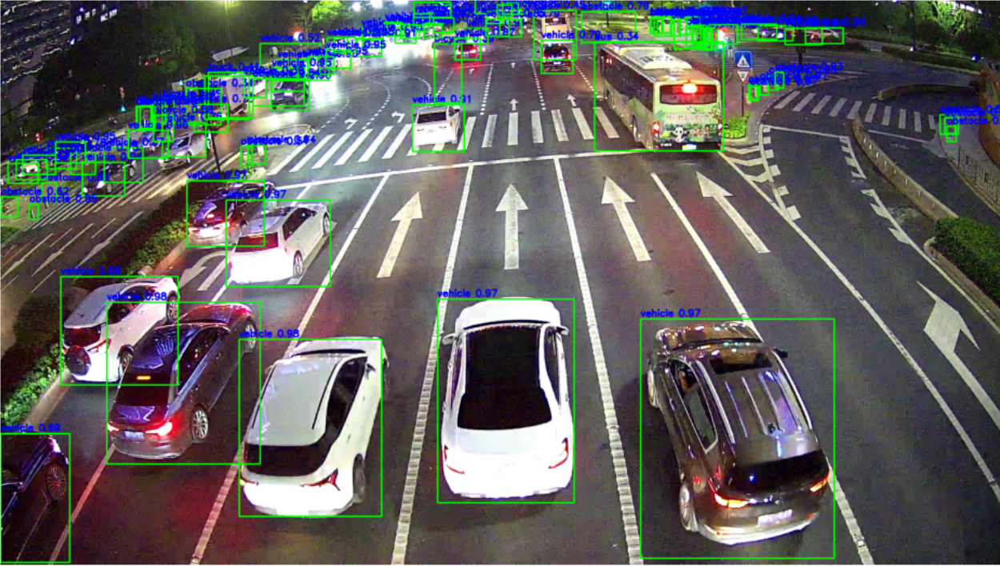

# Задача контроля перекрестка  

Что было сделано:  
1. Скачал предобученную модель DETR c HuggingFace (facebook/detr-resnet-50)  
2. Дообучил ее на датасете Intersection-Flow-5K (https://www.kaggle.com/datasets/starsw/intersection-flow-5k)
3. Завернул в контейнер с интерфейсом на streamlit
4. Добавил predict.py для предсказания с консоли
